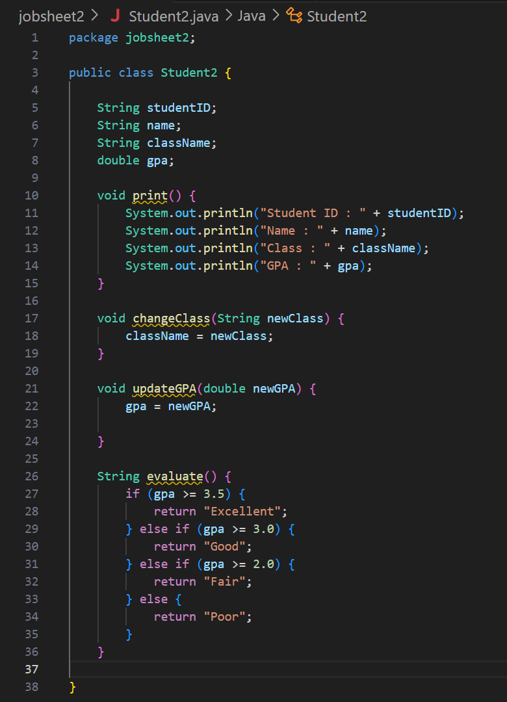

|            | Algorithm and Data Structure                 |
| ---------- | -------------------------------------------- |
| NIM        | 244107020223                                 |
| Nama       | Andhika Daffa Athaaillah                     |
| Kelas      | TI - 1I                                      |
| Repository | [link] (https://githu) |

# Practical Session

# Labs 2 Object

## 2.1 Experiment 1: Declaring Classes, Attributes, and Methods

2.1 Experiment 1: Declaring Classes, Attributes, and Methods

In this experiment, a class will be created along with its attributes and methods. Refer to the following Class Diagram:
Based on the class diagram, a program will be created using the Java programming language.

## 2.1.1 Steps 



## 2.1.2 Verification Experiment Results


My ouput is the same as the example

## 2.1.3 Questions

1. Two characteristics of a class or object:
    - Attributes (State): Variables that store data (e.g., studentID, name, className, gpa).
    - Methods (Behavior): Functions that define actions (e.g., print(), changeClass(), updateGPA(), evaluate()).

2. Attributes of the Student2 class have:
   The Student class has 4 attributes:
    - studentID (String)
    - name (String)
    - className (String)
    - gpa (double)

3. Methods of the Student2 class have:
   The Student class has 4 methods:
    - print() 
    - changeClass(String newClass)
    - updateGPA(double newGPA) 
    - evaluate() 

4. Modified updateGPA() method with validation:

    ```java
   void updateGPA(double newGPA) {
    if (newGPA >= 0.0 && newGPA <= 4.0) {
        gpa = newGPA;
    } else {
        System.out.println("Invalid GPA. Must be between 0.0 and 4.0.");
    }
    }

  
### Explanation:
    - Checks if newGPA is within 0.0 to 4.0.
    - If valid, updates gpa; otherwise, prints an error message.

5. Explanation of the evaluate() method:
- It evaluates student performance based on GPA (gpa).
- Criteria used:
  - gpa >= 3.5 → "Excellent"
  - gpa >= 3.0 → "Good"
  - gpa >= 2.0 → "Fair"
  - gpa < 2.0 → "Poor"
- It returns a String representing the performance level.

## 2.2 Experiment 2: Object Instantiation and Accessing Attributes and Methods

By now, the Student class has been successfully created in Experiment 1. To use the class and access its attributes and methods, an object/instance must be created first through instantiation.

## 2.2.1 Steps


## 2.2.2 Verification of Experiment Results


My output has the same output as the example output

## 2.2.3 Questions

1. Show the line of code in StudentMain used for instantiation. What is the name of the created object?
- Instantiation Line:
```java 
Student2 student1 = new Student2();
 ```
- Object Name: student1

2. How do you access attributes and methods of an object?
- Access Attributes:
```java
student1.name = "Tiara"; // Set
String studentName = student1.name; // Get
```
- Call Methods:
```java
student1.print(); // No arguments
student1.changeClass("TI-2I"); // With argument
```

3. Why does the output of the first and second calls to print() differ?
The changeClass() and updateGPA() methods modified the object’s state between the two calls:
- student1.changeClass("TI-2I") → Changed className from "TI-1I" to "TI-2I".
- student1.updateGPA(3.9) → Updated gpa from 3.8 to 3.9

## 2.3 Experiment 3: Creating Constructor
In this experiment, you will implement different constructors based on parameters.

## 2.3.1 Steps
- add the two constructors  

- add another object called student2


## 2.3.2 Verification of Experiment Results


My output has the same output as the example output

## 2.3.3 Questions 
1. Show the line of code in Student used to declare the parameterized constructor.
- Line of Code in Student2 for Parameterized Constructor Declaration
```java
public Student2(String id, String name, String cls, double gpa) {
    studentID = id;
    this.name = name;
    className = cls;
    this.gpa = gpa;
}
```

2. In StudentMain, explain what the following line of code does:
```java
Student student2 = new Student("244107020040", "Rizky", "TI-1I", 3.5);
```
- What it does:
Creates a new Student2 object named student2.
Initializes attributes directly via the parameterized constructor:
    - studentID = "244107020040"
    - name = "Rizky"
    - className = "TI-1I"
    - gpa = 3.5
- Alternative: Without the constructor, you would need separate assignments (like for student1).

3. Remove the default constructor from Student, then compile and run the program. What
happens? Explain why.
- Result:
Compilation Error at Student2 student1 = new Student2(); in StudentMain.
- Why?
    - If no constructors are defined, Java provides a default one.
    - If any constructor (e.g., parameterized) is defined, Java does not provide a default.
    - student1 tries to use a no-arg constructor, which no longer exists.

4. After instantiating an object, do methods in Student need to be accessed in order? Explain.
- No. Methods can be called in any order, as long as the object exists.
- Exception: If a method depends on another method being called first (e.g., initializing data), logic errors may occur.

5. Create a new object named student<StudentName> using the parameterized constructor
from Student class.


## 2.4 Assignments
- The class code for Course2 and CourseMain2
    - Course2
 ```java
    package jobsheet2;

public class Course2 {
    String courseID;
    String name;
    int credit;
    int hour;

    public Course2() {
    }

    public Course2(String courseID, String name, int credit, int hour) {
        this.courseID = courseID;
        this.name = name;
        this.credit = credit;
        this.hour = hour;
    }

    void print() {
        System.out.println("Course ID: " + courseID);
        System.out.println("Name: " + name);
        System.out.println("Credit: " + credit + " SKS");
        System.out.println("Hours: " + hour + " hours/week");
    }

    void changeCredit(int newCredit) {
        credit = newCredit;
        System.out.println("Credit changed to " + newCredit + " SKS.");
    }

    void addHour(int extraHour) {
        hour += extraHour;
        System.out.println("Added " + extraHour + " hours. Total hours: " + hour);
    }

    void reduceHour(int reducedHour) {
        if (hour - reducedHour >= 0) {
            hour -= reducedHour;
            System.out.println("Reduced " + reducedHour + " hours. Remaining hours: " + hour);
        } else {
            System.out.println("Error: Cannot reduce hours below 0.");
        }
    }
}
```
    - CourseMain2

 ```java
package jobsheet2;

public class CourseMain2 {
    public static void main(String[] args) {

        Course2 course1 = new Course2();
        course1.courseID = "TungTungSahur";
        course1.name = "Algorithm and Data Structure";
        course1.credit = 3;
        course1.hour = 2;
        course1.print();
        course1.changeCredit(4);
        course1.addHour(1);
        course1.reduceHour(1);

        Course2 course2 = new Course2("BombardiloCrocodilo", "Linear Algebra", 4, 3);
        course2.print();
        course2.changeCredit(3);
        course2.addHour(2);
        course2.reduceHour(5);
    }
}
```

- output


- The class code for Lecturer2 and LecturerMain2
    - Lecturer2
```java
package jobsheet2;

public class Lecturer2 {
    String lecturerID;
    String name;
    boolean status;
    int startYear;
    String expertiseField;

    public Lecturer2() {
    }

    public Lecturer2(String lecturerID, String name, boolean status, int startYear, String expertiseField) {
        this.lecturerID = lecturerID;
        this.name = name;
        this.status = status;
        this.startYear = startYear;
        this.expertiseField = expertiseField;
    }

    void print() {
        System.out.println("Lecturer ID: " + lecturerID);
        System.out.println("Name: " + name);
        System.out.println("Status: " + (status ? "Active" : "Inactive"));
        System.out.println("Start Year: " + startYear);
        System.out.println("Expertise: " + expertiseField);
    }

    void setStatus(boolean status) {
        this.status = status;
        System.out.println("Status updated to: " + (status ? "Active" : "Inactive"));
    }

    int calculateTenure(int yearNow) {
        int tenure = yearNow - startYear;
        System.out.println("Tenure: " + tenure + " years");
        return tenure;
    }

    void changeExpertiseField(String newField) {
        expertiseField = newField;
        System.out.println("Expertise changed to: " + newField);
    }
}
```

    - LecturerMain2
```java
package jobsheet2;

public class LecturerMain2 {
    public static void main(String[] args) {

        Lecturer2 lecturer1 = new Lecturer2();
        lecturer1.lecturerID = "Sigma1";
        lecturer1.name = "Sir. Imam";
        lecturer1.status = true;
        lecturer1.startYear = 2010;
        lecturer1.expertiseField = "Computer Science";
        lecturer1.print();
        lecturer1.setStatus(false);
        lecturer1.calculateTenure(2023);
        lecturer1.changeExpertiseField("Artificial Intelligence");

        Lecturer2 lecturer2 = new Lecturer2("Sigma2", "Prof. Cahya", true, 2005, "Mathematics");
        lecturer2.print();
        lecturer2.setStatus(true);
        lecturer2.calculateTenure(2023);
        lecturer2.changeExpertiseField("Data Science");
    }
}
```
- ouput 

